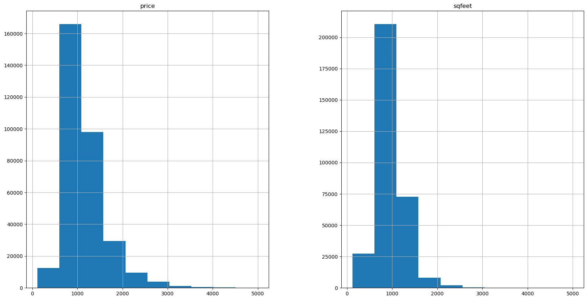

# Rental Property Price Prediction/ Dashboard: Project Overview
*  Utilized statistical techniques and machine learning algorithms in Python (e.g. Linear Regression, Random Forest regressor, Decision Tree Regressor) to build predictive models for rental property prices based on current data.
* Performed exploratory data analysis by exploring the features and the relationship between those features.
* Engineered features and used hyperparameter tunning to reach the best model.
* Utilized Power Bi to design interactive visualizations and reports.

## Data and packages
* Data: https://www.kaggle.com/datasets/austinreese/usa-housing-listings
* Packages: Pandas, Numpy, Matplotlib, Seaborn, Pickle

## Initial Features
       * 'id', 'url', 'region', 'region_url', 'price', 'type', 'sqfeet', 'beds',
       * 'baths', 'cats_allowed', 'dogs_allowed', 'smoking_allowed',
       * 'wheelchair_access', 'electric_vehicle_charge', 'comes_furnished',
       * 'laundry_options', 'parking_options', 'image_url', 'description', 'lat',
       * 'long', 'state'
       
 ## Data Cleaning
 * Check for missing values
 * Check for the data types
 * Drop features that don't impact the target variable
 * Dimensionality reduction
 * Outliers removal
 

## Feature understanding
### I looked at the distributions of the data for various features.

  
  

  
  
##Feature relationship
  
 
 # Model Building
 ### Label Encoding with OneHotEncoding
 ### Split the data between features and target variable 'Price'
 ### Tuned hyperparameters and evaluated model performance using the R-squared as a metric:
 
 
 # Model performance: the Decision Tree regressor model outperformed the linear regression model models on the test and validation sets
 ### Linear Regression:  R^2 = 74%
 ### Decision Tree Regressor: R^2 = 82%
 
 
 # Saved the model with Pickle for future use
